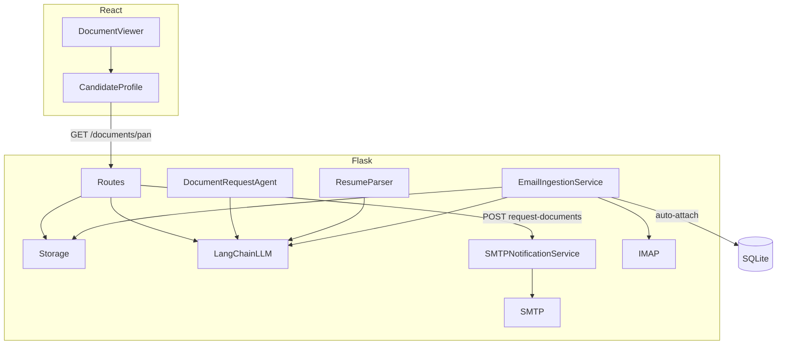

# Phase 8 — Document Viewing, Email Automation, LangChain, Docker

## Goals

1. **View submitted documents** on candidate profile (PAN, Aadhaar previews + download)
2. **Send real emails** via SMTP when configured; show send status in UI
3. **Auto-ingest email replies** via IMAP — match candidate by sender email, classify attachments with LangChain, attach to profile
4. **LangChain** for all LLM calls (resume parse, doc request, attachment classification)
5. **Docker Compose** for one-command local run

## Architecture



## Implementation Plan

### 1. Document Viewing (API + UI)

| Task | Detail |
|------|--------|
| API metadata | Add `documents: { pan, aadhaar, resume }` with `{ available, filename, url }` to `to_detail_dict()` |
| Serve endpoint | `GET /candidates/<id>/documents/<type>` where type ∈ `pan`, `aadhaar`, `resume` — `send_file` with correct mimetype |
| Security | Only serve files belonging to that candidate; 404 if missing |
| UI | `DocumentViewer.jsx` — image preview inline, PDF as download link, "Open in new tab" |

### 2. LangChain Migration

| Task | Detail |
|------|--------|
| Deps | `langchain`, `langchain-google-genai`, `langchain-core` |
| Client | `LangChainGeminiClient` wraps `ChatGoogleGenerativeAI` + `JsonOutputParser` |
| Factory | Default to LangChain client; keep `LLMClient` ABC unchanged |
| Agents | `resume_parser`, `document_agent`, new `attachment_classifier` use same client |

### 3. Email Send (SMTP)

| Task | Detail |
|------|--------|
| Config | `SMTP_HOST`, `SMTP_PORT`, `SMTP_USER`, `SMTP_PASSWORD`, `SMTP_FROM`, `SMTP_USE_TLS` |
| Service | `SMTPNotificationService` sends HTML/plain email; falls back to stub if SMTP not configured |
| Model | Add `DocumentRequest.sent_at`, `send_status` (`sent`/`failed`/`stub`), `recipient` |
| UI | Show "Email sent to …" or "Logged only (SMTP not configured)" after request |

### 4. Email Auto-Ingest (IMAP)

| Task | Detail |
|------|--------|
| Config | `IMAP_HOST`, `IMAP_PORT`, `IMAP_USER`, `IMAP_PASSWORD` |
| Service | `EmailIngestionService.poll_inbox()` — fetch unseen emails with attachments |
| Match | Match `From` address to `Candidate.email` (case-insensitive) |
| Classify | LangChain prompt: given filenames + optional OCR snippet, return `{ pan_index, aadhaar_index }` |
| Save | Store attachments via `LocalStorageService`, update `pan_path`/`aadhaar_path`, status → `documents_submitted` |
| Trigger | `POST /candidates/sync-inbox` endpoint + optional background thread on startup |
| UI | "Sync inbox" button on dashboard; toast with count of processed replies |

### 5. Docker Compose

```yaml
services:
  app:        # Flask + built React, port 5000
  mailhog:    # SMTP test server (1025/8025) — optional for email demo
```

| File | Purpose |
|------|---------|
| `Dockerfile` | Multi-stage: npm build → Python runtime |
| `docker-compose.yml` | app + mailhog + volume for uploads/db |
| `.dockerignore` | Exclude node_modules, .venv, uploads |

## Assumptions

- Full IMAP auto-read requires a real mailbox; MailHog handles **outbound** SMTP testing only. IMAP ingest works with Gmail/Outlook when credentials are set.
- SMS remains stubbed; email is the primary automated channel.
- LangChain adds ~minimal overhead; justified in README for structured chains + future extensibility.

## Execution Order

1. Document viewing (API → UI)
2. LangChain migration
3. SMTP notification
4. IMAP ingestion
5. Docker
6. Tests + README
