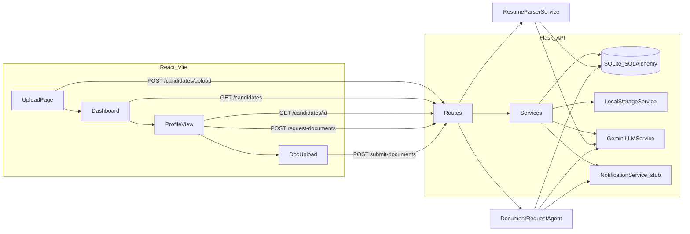

# TraqCheck — Implementation Plan

Greenfield build in [`c:\Users\sleep\Desktop\assignment`](c:\Users\sleep\Desktop\assignment). Only [`traqcheck_build_prompt.md`](traqcheck_build_prompt.md) exists today. Follow the prompt’s 7-phase order; pause for a brief summary after each phase during execution.

**Assumptions (document in README):**
- **LLM:** Google Gemini as primary provider (your choice), via a provider-agnostic abstraction. Anthropic/OpenAI/OpenRouter remain swappable via `LLM_PROVIDER` env var.
- **Deployment:** Railway full-stack (API + built React static assets served by Flask, or separate Railway services if simpler).
- **Resume parsing:** Synchronous on upload (as allowed by spec); parsing isolated in a service for future async.
- **Security:** Your Gemini key goes in `.env` only — never committed. Rotate the key you pasted in chat since it was exposed in this session.

---

## Target Architecture



---

## Repository Layout

```
assignment/
├── backend/
│   ├── app/
│   │   ├── __init__.py          # app factory, CORS, blueprints
│   │   ├── config.py            # env-driven config
│   │   ├── models/
│   │   │   ├── candidate.py
│   │   │   └── document_request.py
│   │   ├── routes/
│   │   │   └── candidates.py    # all 5 endpoints
│   │   └── services/
│   │       ├── storage.py       # StorageService + LocalStorageService
│   │       ├── resume_extractor.py  # PDF/DOCX → text (pypdf + python-docx)
│   │       ├── llm/
│   │       │   ├── base.py      # abstract LLMClient
│   │       │   ├── gemini.py
│   │       │   ├── anthropic.py # stub/swap-in
│   │       │   └── factory.py   # get_llm_client()
│   │       ├── resume_parser.py # LLM structured parse + confidence
│   │       ├── document_agent.py
│   │       └── notification.py  # stub send()
│   ├── tests/
│   │   ├── conftest.py          # temp DB, test client, mock LLM
│   │   ├── test_upload_parse.py
│   │   └── test_document_request.py
│   ├── uploads/                 # gitignored
│   ├── requirements.txt
│   ├── run.py
│   └── seed.py
├── frontend/
│   ├── src/
│   │   ├── api/client.js
│   │   ├── pages/UploadPage.jsx
│   │   ├── pages/Dashboard.jsx
│   │   ├── pages/CandidateProfile.jsx
│   │   └── components/          # badges, confidence bar, dropzone
│   ├── tailwind.config.js
│   └── vite.config.js           # proxy to Flask in dev
├── samples/
│   └── sample_resume.pdf        # generated minimal PDF for graders
├── .env.example
├── .gitignore
├── railway.toml                 # or Procfile + nixpacks config
└── README.md
```

---

## Phase 1 — Backend Skeleton + DB + Upload (no AI)

**Goal:** Runnable Flask app with models, file upload, and status tracking.

| Task | Detail |
|------|--------|
| App factory | [`backend/app/__init__.py`](backend/app/__init__.py): create app, init SQLAlchemy, register `candidates` blueprint, enable CORS for `http://localhost:5173` |
| Config | [`backend/app/config.py`](backend/app/config.py): `DATABASE_URL`, `UPLOAD_FOLDER`, `LLM_PROVIDER`, `GEMINI_API_KEY`, `MAX_UPLOAD_MB=10` |
| Models | **Candidate:** `id`, `filename`, `resume_path`, `name`, `email`, `phone`, `company`, `designation`, `skills` (JSON), `field_confidence` (JSON), `raw_text`, `status` enum (`processing`/`parsed`/`failed`/`documents_submitted`), `pan_path`, `aadhaar_path`, `created_at`. **DocumentRequest:** `id`, `candidate_id`, `message`, `channel`, `created_at` |
| Storage service | [`backend/app/services/storage.py`](backend/app/services/storage.py): `save(file, subfolder) -> path`, `validate_extension()`, interface for future S3 |
| Upload endpoint | `POST /candidates/upload`: validate PDF/DOCX only → 400 otherwise; save via storage; set status `processing`; call `resume_extractor.extract_text()` synchronously; store raw text; return `201 { id, filename, status }` (status stays `processing` until Phase 2 parse completes) |
| Migrations | Use `db.create_all()` for simplicity (note PostgreSQL swap in README) |

**Phase 1 exit check:** `curl -F resume=@samples/sample_resume.pdf localhost:5000/candidates/upload` returns 201; file on disk; row in DB.

---

## Phase 2 — LLM Resume Parsing + Confidence

**Goal:** After upload, populate structured fields with confidence scores.

| Task | Detail |
|------|--------|
| LLM abstraction | [`backend/app/services/llm/base.py`](backend/app/services/llm/base.py): `complete_json(prompt, schema, timeout=30) -> dict`; factory picks provider from env |
| Gemini client | [`backend/app/services/llm/gemini.py`](backend/app/services/llm/gemini.py): use `google-generativeai` with JSON response; handle missing key → raise `LLMUnavailableError` |
| Parse prompt | Strict JSON schema: `{ name, email, phone, company, designation, skills[], confidence: { field: 0-1 } }`; instruct model to self-report certainty |
| Resilience | Validate JSON with Pydantic; **retry once** on malformed output; on second failure set fields to `null` with confidence `0.1` and status `failed` (partial raw_text preserved) |
| Heuristic boost | Post-process: regex-valid email/phone → bump confidence to min 0.9; comment in code explaining hybrid approach |
| Wire upload | Upload flow: extract text → `resume_parser.parse()` → update candidate → status `parsed` or `failed` |

**Phase 2 exit check:** Upload sample resume → DB row has parsed fields + confidence JSON; graceful failure when `GEMINI_API_KEY` unset.

---

## Phase 3 — Remaining Read Endpoints

| Endpoint | Behavior |
|----------|----------|
| `GET /candidates` | List `id, name, email, phone, company, designation, status, created_at`; optional `?status=` filter |
| `GET /candidates/<id>` | Full profile + `skills[]`, per-field confidence, `raw_text` snippet (first 500 chars if parse failed) |
| Errors | 404 for missing id; consistent JSON error shape |

**Phase 3 exit check:** Both endpoints return correct shapes via manual/API test.

---

## Phase 4 — Document Request Agent + Logging

| Task | Detail |
|------|--------|
| Agent service | [`backend/app/services/document_agent.py`](backend/app/services/document_agent.py): prompt with candidate context; generate professional, personalized PAN/Aadhaar request (KYC/background verification, clear next steps); channel default `email` |
| Notification stub | [`backend/app/services/notification.py`](backend/app/services/notification.py): `send(channel, recipient, message) -> bool` logs only |
| Endpoint | `POST /candidates/<id>/request-documents`: require status `parsed`; generate message; insert `DocumentRequest`; return `{ message, channel, created_at }` |
| Degradation | LLM failure → 503 with `{ error, status: "failed" }`, no crash |

**Phase 4 exit check:** Trigger request on parsed candidate → message in response + row in `document_requests`.

---

## Phase 5 — Document Submission Endpoint

| Endpoint | Behavior |
|----------|----------|
| `POST /candidates/<id>/submit-documents` | Accept `pan_document`, `aadhaar_document` (jpg/png/pdf); reject >10MB or bad type with 400 |
| Storage | Save under `uploads/documents/<candidate_id>/` |
| Update | Set status `documents_submitted`; return `{ status, pan_file, aadhaar_file }` references (paths or URLs) |

**Phase 5 exit check:** Submit two sample images → status updated; files stored.

---

## Phase 6 — React Frontend

**Stack:** Vite + React + Tailwind + React Router + axios/fetch.

| Page | Features |
|------|----------|
| **Upload** (`/`) | Drag-and-drop zone; upload progress bar; on success redirect to profile or dashboard |
| **Dashboard** (`/candidates`) | Table with color badges: processing (yellow), parsed (green), failed (red), documents_submitted (blue); status filter dropdown |
| **Profile** (`/candidates/:id`) | Fields with confidence % or color bar; raw text snippet if failed; **Request Documents** button → shows generated message panel; PAN/Aadhaar upload with previews + pending/submitted state |
| Dev proxy | Vite proxies `/api` → Flask `:5000` (or prefix routes with `/api` in Flask) |
| Error UX | Surface API errors (missing LLM key, parse failed) inline, not blank screens |

**Phase 6 exit check:** Full manual flow in browser: upload → dashboard → profile → request docs → submit docs.

---

## Phase 7 — README, Samples, Tests, Railway Deploy

| Deliverable | Content |
|-------------|---------|
| **`.env.example`** | `DATABASE_URL`, `GEMINI_API_KEY`, `LLM_PROVIDER=gemini`, `FLASK_ENV`, `CORS_ORIGINS`, `UPLOAD_FOLDER` |
| **`samples/`** | Minimal PDF resume with fake name/email/company for immediate testing |
| **`seed.py`** | Optional: pre-seed one parsed candidate for demo without LLM |
| **Tests** | pytest: (1) upload + mock LLM parse → status `parsed`; (2) document request → message logged. Use temp SQLite + mocked `LLMClient` |
| **README.md** | Architecture diagram (mermaid or ASCII); setup (backend `pip install`, frontend `npm install`); env vars; assumptions; **demo disclaimer** for PAN/Aadhaar; Loom checklist placeholder; live Railway URL |
| **Railway** | Single service: build frontend (`npm run build`), copy `dist/` into Flask static; `gunicorn run:app`; persistent volume for `uploads/` + SQLite path; set env vars in Railway dashboard |
| **Git history** | Incremental commits per phase (not one blob commit) |

**Security note for README:** This is a demo KYC flow — do not use real government IDs; sample data only.

---

## Key Dependencies

**Backend (`requirements.txt`):** `flask`, `flask-sqlalchemy`, `flask-cors`, `python-dotenv`, `pypdf`, `python-docx`, `google-generativeai`, `pydantic`, `pytest`, `gunicorn`

**Frontend (`package.json`):** `react`, `react-router-dom`, `axios`, `tailwindcss`, `@headlessui/react` (optional for polish)

---

## API ↔ Frontend Contract (quick reference)

All responses JSON. Status codes: 201 upload, 200 reads/submit, 400 validation, 404 not found, 503 LLM unavailable.

---

## Execution Order Summary

Build strictly phases 1→7. After each phase, report: what works, how to run it, and any deviations from spec.

**Immediate first step after plan approval:** Scaffold Phase 1 backend, `.gitignore`, `.env.example`, and a placeholder `samples/` PDF.
