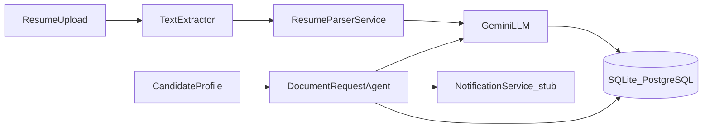

# ResumeParser

ResumeParser is a resume intake system for HR teams. Upload a candidate resume, extract structured profile data with an LLM, and autonomously draft a personalized request for PAN and Aadhaar identity documents.

> **Demo disclaimer:** This is a hiring-assignment demo, not a production KYC system. Do not upload real government ID documents. All sample data is fictional.

## Live deployment

**Railway URL:** _Add your deployed URL here after running `railway up`_

If deployment is not yet configured, run locally using the instructions below.

## Architecture



**Flow:**
1. HR uploads PDF/DOCX resume → file saved to storage → text extracted
2. Resume text sent to Gemini with strict JSON schema → structured fields + confidence scores stored
3. HR triggers document request → agent drafts personalized PAN/Aadhaar message → logged (not sent)
4. Candidate documents uploaded → stored locally → status updated to `documents_submitted`

## Tech stack

| Layer | Choice |
|-------|--------|
| Backend | Python, Flask (app factory) |
| Frontend | React (Vite), Tailwind CSS |
| Database | SQLite (dev), SQLAlchemy ORM — swap `DATABASE_URL` for PostgreSQL |
| LLM | Google Gemini (primary), via LangChain (`langchain-google-genai`) |
| Storage | Local `/uploads` folder, abstracted for future S3 |
| Agent | Prompt-chained services powered by LangChain |

## Assumptions & tradeoffs

- **LLM provider:** Gemini integrated via LangChain; abstraction supports adding Anthropic/OpenAI/OpenRouter without changing business logic.
- **Synchronous parsing:** Resume parsing runs inline on upload for simplicity; the parser is a separate service callable from a background job later.
- **Confidence scoring:** Hybrid approach — LLM self-reported certainty plus regex boosts for validated email/phone (see `resume_parser.py` comments).
- **Notifications:** `SMTPNotificationService` supports real SMTP email delivery (e.g. using MailHog locally or real SMTP relay). If host/credentials are not configured, it gracefully falls back to logging to output (`StubNotificationService`).
- **Inbound Auto-Ingest:** `EmailIngestionService` uses IMAP to poll for unseen replies from candidates, parsing attachments (via heuristic/LLM) to automatically attach files (PAN/Aadhaar) to their profiles. A background thread (`inbox_poller.py`) polls automatically every `IMAP_POLL_INTERVAL_SECONDS` (default 300s) when IMAP is configured; the "Sync Email Inbox" button remains available as a manual trigger.
- **Review before send:** Generating the document request message (LLM draft) and sending it are separate steps — HR can edit the drafted text before it goes out.

## Project structure

```
backend/app/          Flask app factory, models, routes, services
frontend/src/         React pages and components
samples/              Sample resume for testing
backend/tests/        Pytest suite
```

## Setup — local development

### Prerequisites

- Python 3.11+
- Node.js 20+
- Gemini API key ([Google AI Studio](https://aistudio.google.com/))

### 1. Environment

```bash
cp .env.example .env
# Edit .env and set GEMINI_API_KEY, SMTP/IMAP credentials
```

### 2. Backend

```bash
cd backend
python -m venv .venv
# Windows: .venv\Scripts\activate
# macOS/Linux: source .venv/bin/activate
# Note: Ensure you run with the correct environment variables loaded or in .env file
pip install -r requirements.txt
python run.py
```

API runs at `http://localhost:5000`.

### 3. Frontend

```bash
cd frontend
npm install
npm run dev
```

UI runs at `http://localhost:5173` (Vite dev server proxies `/candidates` API calls to Flask).

### 4. Docker Compose (Alternative quickstart)

You can run the entire application using Docker Compose. By default it uses the real `SMTP_*`/`IMAP_*` values from `.env`, so document request emails and inbox auto-attach work end to end against your real mailbox:

```bash
# Backend + built frontend, one container, port 5000
docker-compose up --build

# Same, plus frontend in live-reload dev mode on port 5173
docker-compose --profile dev up --build
```
The app UI is at `http://localhost:5000` (or `http://localhost:5173` in the dev profile).

If you'd rather not send real email while testing, opt into the bundled MailHog capture server instead: set `SMTP_HOST=mailhog`, `SMTP_PORT=1025`, `SMTP_USE_TLS=false` in `.env`, then run `docker-compose --profile mailhog up --build` and view captured mail at `http://localhost:8025`. Note MailHog only captures outbound mail — it has no real inbox, so IMAP auto-attach won't have anything to poll while routed through it.

### 5. Optional seed data

```bash
cd backend
python seed.py
```

### 6. Generate sample resume

```bash
cd backend
python scripts/generate_sample_resume.py
# Output: backend/samples/sample_resume.pdf (also copied to ../samples/ for submission)
```

## Environment variables

| Variable | Required | Description |
|----------|----------|-------------|
| `DATABASE_URL` | No | Default: `sqlite:///traqcheck.db` |
| `GEMINI_API_KEY` | Yes (for LLM) | Google Gemini API key |
| `LLM_PROVIDER` | No | Default: `gemini` (uses langchain) |
| `UPLOAD_FOLDER` | No | Default: `backend/uploads` |
| `MAX_UPLOAD_MB` | No | Default: `10` |
| `CORS_ORIGINS` | No | Default: `http://localhost:5173` |
| `FLASK_ENV` | No | `development` or `production` |
| `SMTP_HOST` | No | SMTP server hostname for outbound email |
| `SMTP_PORT` | No | SMTP server port (default: 587) |
| `SMTP_USER` | No | SMTP server username |
| `SMTP_PASSWORD`| No | SMTP server password |
| `SMTP_FROM` | No | sender address for outbound emails |
| `SMTP_USE_TLS` | No | Enable TLS (default: true) |
| `IMAP_HOST` | No | IMAP server hostname for inbound email |
| `IMAP_PORT` | No | IMAP server port (default: 993) |
| `IMAP_USER` | No | IMAP server username |
| `IMAP_PASSWORD`| No | IMAP server password |
| `IMAP_USE_SSL` | No | Enable SSL (default: true) |

## API endpoints

| Method | Path | Description |
|--------|------|-------------|
| POST | `/candidates/upload` | Upload resume (PDF/DOCX) |
| GET | `/candidates` | List candidates (`?status=` filter) |
| GET | `/candidates/<id>` | Full profile + confidence + docs metadata |
| GET | `/candidates/<id>/documents/<doc_type>` | Serve file (PAN / Aadhaar / Resume) |
| POST | `/candidates/<id>/generate-document-request` | Draft a personalized document request message (not sent) |
| POST | `/candidates/<id>/request-documents` | Send a (reviewed/edited) document request message |
| POST | `/candidates/<id>/submit-documents` | Upload identity documents manually |
| POST | `/candidates/sync-inbox` | Trigger IMAP inbox check and auto-ingest |
| GET | `/health` | Health check |

## Tests

```bash
cd backend
pytest -q
```

Covers:
- Resume upload → parse flow (mocked LLM)
- Document request generation + DB logging
- Identity document submission + status update

## Railway deployment

1. Push repo to GitHub
2. Create a new Railway project → Deploy from GitHub
3. Set environment variables (`GEMINI_API_KEY`, `DATABASE_URL` for PostgreSQL recommended)
4. Railway uses `railway.json` build/start commands
5. Add persistent volume mounted at `backend/uploads` for file storage

## Loom walkthrough checklist (≤5 min)

Record yourself covering:

- [ ] Architecture overview (upload → parse → LLM → DB → document request agent)
- [ ] Upload a sample resume from `/samples`
- [ ] View extracted data and confidence scores on candidate profile
- [ ] Generate a document request message, edit it, and send it
- [ ] (Optional) Submit demo PAN/Aadhaar files and show status change

_Paste your Loom link here: _______________

## License

MIT — assignment submission.
