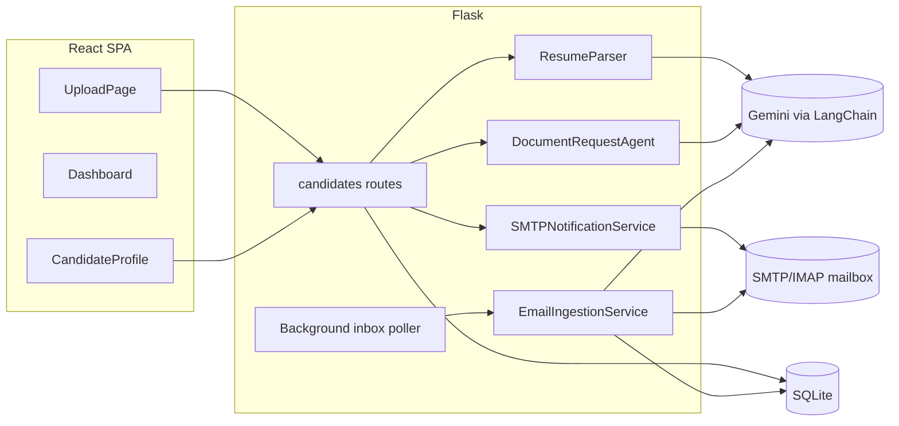

# ResumeParser

Upload a candidate's resume, extract structured profile data with an LLM, and automatically request — then collect — their PAN and Aadhaar identity documents by email.

> **Demo disclaimer:** This is a hiring-assignment demo, not a production KYC system. Do not upload real government ID documents. All sample data is fictional.

## Quick start (Docker Compose)

**Prerequisites:** Docker Desktop, a [Gemini API key](https://aistudio.google.com/), and a mailbox with SMTP + IMAP access (e.g. Gmail with an [App Password](https://myaccount.google.com/apppasswords)).

```bash
cp .env.example .env
# then edit .env — see "Environment variables" below
docker-compose up --build
```

Open **http://localhost:5000** — that's the whole app (API + UI in one container).

Stop it with `docker-compose down` (add `-v` only if you also want to wipe the named volumes — there aren't any by default, since uploads/DB persist to `backend/` on your host).

### Environment variables

Copy `.env.example` to `.env` and fill in:

| Variable | Required | Notes |
|---|---|---|
| `GEMINI_API_KEY` | Yes | Powers resume parsing, message drafting, attachment classification |
| `SMTP_HOST` / `SMTP_PORT` / `SMTP_USER` / `SMTP_PASSWORD` / `SMTP_FROM` | For real email | Gmail: `smtp.gmail.com`, `587`, your address, an App Password, your address |
| `SMTP_FROM_NAME` | No | Display name shown to candidates (default: "ResumeParser Recruiting") — the address itself can't differ from `SMTP_FROM`, since replies route back to it |
| `IMAP_HOST` / `IMAP_PORT` / `IMAP_USER` / `IMAP_PASSWORD` | For auto-attach | Same mailbox as SMTP — Gmail: `imap.gmail.com`, `993` |
| `IMAP_AUTO_POLL` / `IMAP_POLL_INTERVAL_SECONDS` | No | Background inbox polling, on by default every 300s |

If SMTP/IMAP are left blank, the app still works — document requests get logged instead of sent, and inbox sync reports "not configured."

## What it does

1. **Upload** a resume (PDF/DOCX) → text extracted → sent to Gemini → structured fields (name, email, company, skills, …) with confidence scores, stored per candidate.
2. **Generate** a personalized PAN/Aadhaar request message (LLM-drafted), review/edit it, then **send** it by email.
3. **Candidate replies** with attachments → a background poller (or the manual "Sync Email Inbox" button) reads the inbox, classifies attachments via LLM, and auto-attaches them to the right candidate — no manual upload needed. Manual upload is also available as a fallback. Every request email carries a hidden `[Ref: RP-<id>]` tag, so replies match back to the exact candidate row even if two candidates share the same email address.
4. **View** submitted documents (image/PDF preview + download) on the candidate's profile.
5. **Edit** any auto-extracted field if the parser got something wrong — corrected fields are marked as fully confident.
6. **Delete** a candidate to permanently remove their resume, documents, and request history.

## Architecture



Everything runs in one Flask process: the API, the LLM calls, and a daemon thread that polls the mailbox on an interval. The React app is built once and served as static files by the same Flask app — there's no separate frontend server in production.

## Project structure

```
backend/app/
  models/        Candidate, DocumentRequest (SQLAlchemy)
  routes/        candidates.py — all API endpoints
  services/      resume parsing, LLM client, document request drafting,
                 SMTP send, IMAP ingest + classification, local file storage
backend/tests/   Pytest suite
backend/scripts/ copy_frontend.py, generate_sample_resume.py
frontend/src/    pages/ (Upload, Dashboard, CandidateProfile), components/
samples/         Sample resume for testing the upload flow
```

## Tests

```bash
cd backend
pytest -q
```

## API endpoints

| Method | Path | Description |
|---|---|---|
| POST | `/candidates/upload` | Upload resume (PDF/DOCX) |
| GET | `/candidates` | List candidates (`?status=` filter) |
| GET | `/candidates/<id>` | Full profile + confidence + document metadata |
| PATCH | `/candidates/<id>` | Correct auto-extracted fields (name/email/phone/company/designation/skills) |
| DELETE | `/candidates/<id>` | Permanently delete candidate, files, and request history |
| GET | `/candidates/<id>/documents/<type>` | Serve a file (`pan` / `aadhaar` / `resume`) |
| POST | `/candidates/<id>/generate-document-request` | Draft a request message (not sent) |
| POST | `/candidates/<id>/request-documents` | Send a (reviewed/edited) request message |
| POST | `/candidates/<id>/submit-documents` | Upload PAN/Aadhaar manually |
| POST | `/candidates/sync-inbox` | Manually trigger an inbox check |
| GET | `/health` | Health check |

## License

MIT — assignment submission.
